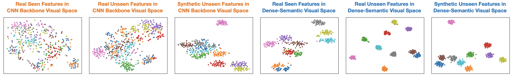
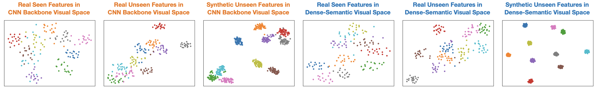
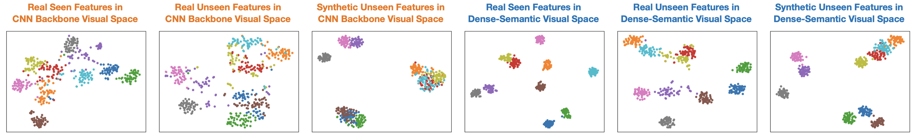
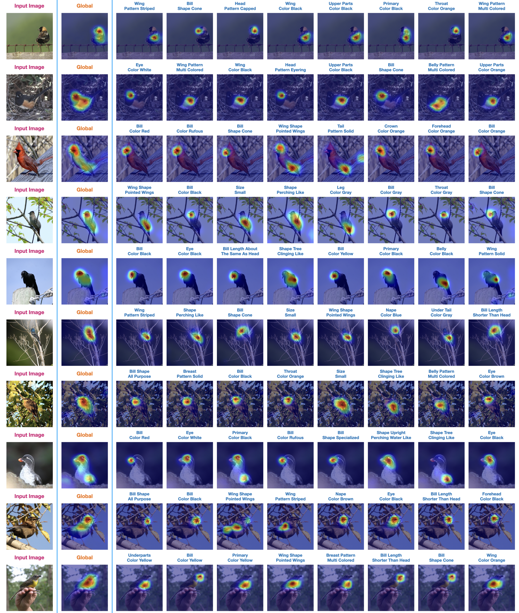

# Semantic Compression Embedding for Generative Zero-Shot Learning

This repository contains online resources of the paper **"Semantic Compression Embedding for Generative Zero-Shot Learning"** accepted to IJCAI-2022.

## Visualization

### t-SNE Visualization

We present the t-SNE visualizations of real seen/unseen and synthetic unseen visual features in CNN backbone visual space and dense-semantic visual space. 

CUB Dataset:

SUN Dataset:

AWA2 Dataset:


### Attention Maps

The first column shows the input images, the second column shows the global attention maps of GEN, and the other columns are local attention maps of LEN with top-8 attention scores.




## Training

The code is under preparation and coming soon.

## Citation
```
@inproceedings{hong2022semantic,
    title     = {Semantic Compression Embedding for Generative Zero-Shot Learning},
    author    = {Hong, Ziming and Chen, Shiming and Xie, Guo-Sen and Yang, Wenhan and Zhao, Jian and Shao, Yuanjie and Peng, Qinmu and You, Xinge},
    booktitle = {The 31st International Joint Conference on Artificial Intelligence},
    year      = {2022}
}
```