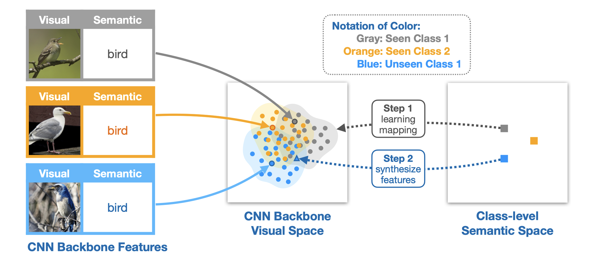
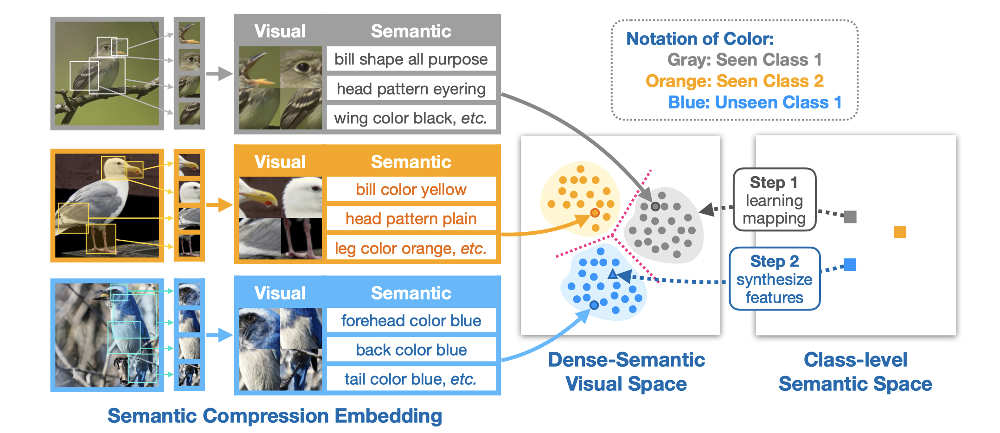
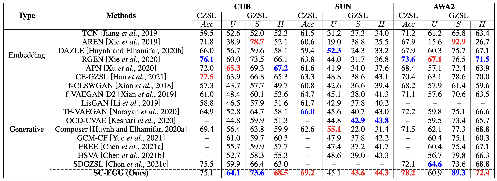

# Semantic Compression Embedding for Generative Zero-Shot Learning

**<font color='coral'>!!! Updates of this project will be finished before </font>*****<font color='purple'>Jan 1, 2023.</font>***

This repository contains online resources of the paper **"Semantic Compression Embedding for Generative Zero-Shot Learning"** accepted to IJCAI-2022. [[PDF](https://www.ijcai.org/proceedings/2022/0134.pdf)]
**Motivation** (**Left**: existing generative ZSLs, **Right**: proposed SC-EGG):
<div align="center">


</div>

## Requirements
The implementation of **SC-EGG** is mainly based on Python 3.8.8 and [PyTorch](https://pytorch.org/) 1.8.0. We use [Weights & Biases](https://wandb.ai/site) (W&B) to keep track and organize the results of experiments. Please follow the [online documentation](https://docs.wandb.ai/quickstart) of W&B to quickstart. To install all required dependencies:
```
$ pip install -r requirements.txt
```
## Datasets 
We trained the model on [CUB](http://www.vision.caltech.edu/visipedia/CUB-200-2011.html), [SUN](http://cs.brown.edu/~gmpatter/sunattributes.html) and [AWA2](http://cvml.ist.ac.at/AwA2/) following the data split of [xlsa17](http://datasets.d2.mpi-inf.mpg.de/xian/xlsa17.zip). In order to train the **SC-EGG**, you should firstly download these datasets as well as the xlsa17. Then decompress and organize them as follows: 
```
.
├── data
│   ├── CUB/CUB_200_2011/...
│   ├── SUN/images/...
│   ├── AWA2/Animals_with_Attributes2/...
│   └── xlsa17/data/...
└── ···
```
Preprocessing the visual features is also needed:

```
$ python preprocessing.py --dataset CUB --compression
$ python preprocessing.py --dataset SUN --compression
$ python preprocessing.py --dataset AWA2 --compression
```

## Training SC-EGG from Scratch
In `./wandb_config`, we provide our parameters setting of conventional ZSL (CZSL) and generalized ZSL (GZSL) tasks for CUB, SUN, and AWA2. You can run the following commands to train the **SC-EGG** from scratch:

```
$ python train_joint_CUB.py
$ python train_joint_SUN.py 
$ python train_joint_AWA2.py 
```

## Results


## Visualization

### t-SNE Visualization
We present the t-SNE visualizations of real seen/unseen and synthetic unseen visual features in CNN backbone visual space and dense-semantic visual space. 

CUB Dataset:

SUN Dataset:

AWA2 Dataset:


### Attention Maps
The first column shows the input images, the second column shows the global attention maps of GEN, and the other columns are local attention maps of LEN with top-8 attention scores.


## References
Parts of the codes based on:
* [hbdat/cvpr20_DAZLE](https://github.com/hbdat/cvpr20_DAZLE)
* [akshitac8/tfvaegan](https://github.com/akshitac8/tfvaegan)

## Citation
If this work is helpful for you, please cite our paper.
```
@inproceedings{ijcai2022p0134,
  title     = {Semantic Compression Embedding for Generative Zero-Shot Learning},
  author    = {Hong, Ziming and Chen, Shiming and Xie, Guo-Sen and Yang, Wenhan and Zhao, Jian and Shao, Yuanjie and Peng, Qinmu and You, Xinge},
  booktitle = {Proceedings of the Thirty-First International Joint Conference on Artificial Intelligence, {IJCAI-22}},
  publisher = {International Joint Conferences on Artificial Intelligence Organization},
  editor    = {Lud De Raedt},
  pages     = {956--963},
  year      = {2022},
  month     = {7},
  note      = {Main Track},
  doi       = {10.24963/ijcai.2022/134},
  url       = {https://doi.org/10.24963/ijcai.2022/134},
}
```